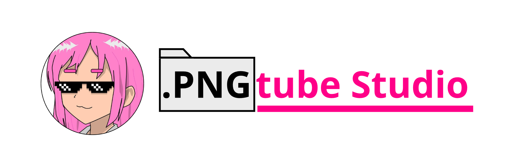

## PngtubeStudio



This project seeks to be an alternative for PNGtubers, integrating tools more dedicated to said format, seeking to be a program based on community comments.

*This project was bootstrapped with [NodeJs](https://nodejs.org), [ElectronJs](https://www.electronjs.org) and [ReactJs](https://react.dev)*
*config by [Electron-Vite](https://electron-vite.org/)*

## Instalation

```bash
$ git clone https://github.com/PintoGamer64/PngtubeStudio.git
$ cd PngtubeStudio
$ npm install
```

### Development

```bash
$ npm run dev
or
$ bun run dev
```

### Build

```bash
# For windows
$ npm run build:win
```